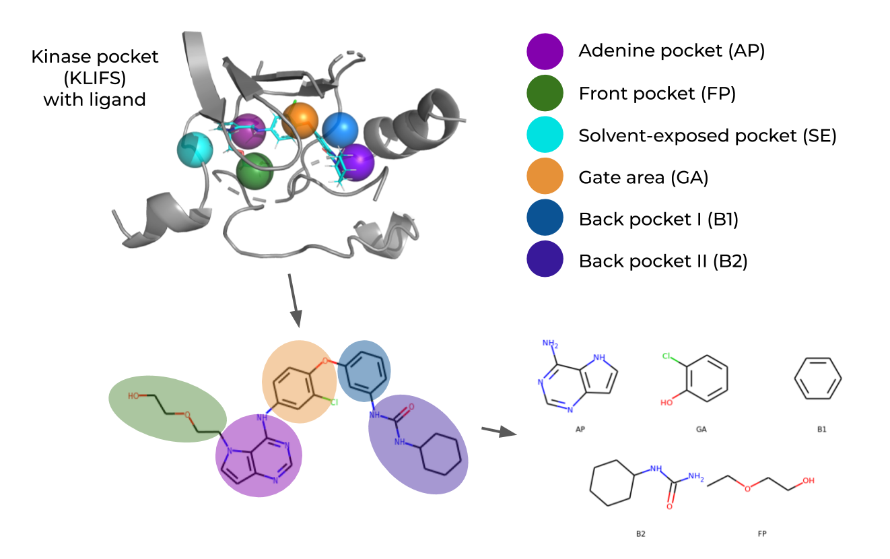

# KinFragLib: Kinase-focused fragment library

[](https://github.com/volkamerlab/KinFragLib/actions?query=workflow%3ACI)



Please note that this repository is constantly updated, hence the statistics and numbers derive from the paper. You can retrieve the repository state for the published KinFragLib paper in release [v1.0.0](https://github.com/volkamerlab/KinFragLib/releases/tag/v1.0.0).

## Table of contents

- [Description](#description)
- [Repository content](#repository-content)
- [Quick start](#quick-start)
- [Contact](#contact)
- [License](#license)
- [Citation](#citation)

## Repository content

This repository holds the following resources:  

1. Fragment library data and a link to the combinatorial library data.
2. *Quick start* notebook explaining how to load and use the fragment library.  
3. Notebooks covering the full analyses regarding the fragment and combinatorial libraries as described in 
the corresponding paper.  
    
Please find detailed description of files in `data/` and `notebooks/` in the folders' `README` files.

## Description

**Exploring the kinase inhibitor space using subpocket-focused fragmentation and recombination**

Protein kinases play a crucial role in many cell signaling processes, 
making them one of the most important families of drug targets.
Fragment-based drug design has proven useful as one approach to develop novel kinase inhibitors. 
Usually, fragment-based methods follow a knowledge-driven approach, i.e., optimizing a focused set of fragments into 
molecular hits. 

We present here *KinFragLib*, a data-driven kinase-focused fragment library based on the structural kinome data 
retrieved from the [KLIFS](https://klifs.vu-compmedchem.nl) database.
Each kinase binding pocket (for DFG-in structures with non-covalent ligands) is automatically divided in *KinFragLib* 
into six subpockets, i.e. the adenine pocket (AP), front pocket (FP), solvent-exposed pocket (SE), gate area (GA) as 
well as back pocket 1 and 2 (B1 and B2), based on defined pocket-spanning residues.
Each co-crystallized ligand is fragmented using the BRICS algorithm and its fragments are assigned to the respective 
subpocket they occupy. 
Following this approach, a fragment library is created with respective subpocket pools. This fragment library enables 
an in-depth analysis of the chemical space of known kinase inhibitors, and can be used to enumerate recombined 
fragments in order to generate novel potential inhibitors.

## Quick start

1. Clone this repository.

    ```bash
    git clone https://github.com/volkamerlab/KinFragLib.git
    ```

2. Create the `kinfraglib` conda environment. 

    ```bash
    # Change to KinFragLib directory
    cd /path/to/KinFragLib   
 
    # Create environment
    # Hint: if conda is too slow, consider mamba instead
    conda env create -f environment.yml
    # When using a MacBook with an M1 chip you may need instead:
    CONDA_SUBDIR=osx-64 conda env create -f environment.yml

    # Activate environment
    conda activate kinfraglib

    # Install the kinfraglib pip package
    cd ..
    pip install -e KinFragLib
    ```

3. Open the notebook `quick_start.ipynb` for an introduction on how to load and use the fragment library.

    ```bash
    # Change to KinFragLib directory (if you have not already)
    cd /path/to/KinFragLib
 
    # Start jupyter lab to explore the notebooks
    jupyter lab
    ```

## Contact

Please contact us if you have questions or suggestions.

* Open an issue on our GitHub repository: https://github.com/volkamerlab/KinFragLib/issues
* Or send us an email: andrea.volkamer@charite.de

We are looking forward to hearing from you!

## License

This resource is licensed under the [MIT](https://opensource.org/licenses/MIT) license, a permissive open source license.

## Citation

[Sydow, D., Schmiel, P., Mortier, J., and Volkamer, A. KinFragLib: Exploring the Kinase Inhibitor Space Using Subpocket-Focused Fragmentation and Recombination. J. Chem. Inf. Model. 2020. https://pubs.acs.org/doi/abs/10.1021/acs.jcim.0c00839](CITATION.bib)

```bib
@article{doi:10.1021/acs.jcim.0c00839,
author = {Sydow, Dominique and Schmiel, Paula and Mortier, Jérémie and Volkamer, Andrea},
title = {KinFragLib: Exploring the Kinase Inhibitor Space Using Subpocket-Focused Fragmentation and Recombination},
journal = {Journal of Chemical Information and Modeling},
volume = {60},
number = {12},
pages = {6081-6094},
year = {2020},
doi = {10.1021/acs.jcim.0c00839},
note ={PMID: 33155465},
URL = {https://doi.org/10.1021/acs.jcim.0c00839}
}
```
## List of publications
- **Kinase Inhibitor Scaffold Hopping with Deep Learning Approaches**
Lizhao Hu, Yuyao Yang, Shuangjia Zheng, Jun Xu, Ting Ran, and Hongming Chen
*Journal of Chemical Information and Modeling* **2021**
[10.1021/acs.jcim.1c00608](https://pubs.acs.org/doi/full/10.1021/acs.jcim.1c00608)
- **TWN-FS method: A novel fragment screening method for drug discovery** 
Yoon, Hye Ree and Park, Gyoung Jin and Balupuri, Anand and Kang, Nam Sook
*Computational and Structural Biotechnology Journal* **2023**
[10.1016/j.csbj.2023.09.037](https://doi.org/10.1016/j.csbj.2023.09.037)
- **Efficient Hit-to-Lead Searching of Kinase Inhibitor Chemical Space via Computational Fragment Merging**
Grigorii V. Andrianov, Wern Juin Gabriel Ong, Ilya Serebriiskii, and John Karanicolas
*Journal of Chemical Information and Modeling* **2021** 
[10.1021/acs.jcim.1c00630](https://doi.org/10.1021/acs.jcim.1c00630)
- **KiSSim: Predicting Off-Targets from Structural Similarities in the Kinome**
Dominique Sydow, Eva Aßmann, Albert J. Kooistra, Friedrich Rippmann, and Andrea Volkamer
*Journal of Chemical Information and Modeling* **2022** 
[10.1021/acs.jcim.2c00050](https://10.1021/acs.jcim.2c00050)
- **Target-Focused Library Design by Pocket-Applied Computer Vision and Fragment Deep Generative Linking**
Merveille Eguida, Christel Schmitt-Valencia, Marcel Hibert, Pascal Villa, and Didier Rognan
*Journal of Medicinal Chemistry* **2022** 
[10.1021/acs.jmedchem.2c00931](https://pubs.acs.org/doi/10.1021/acs.jmedchem.2c00931)
- **Guided docking as a data generation approach facilitates structure-based machine learning on kinases**
Backenköhler M, Groß J, Wolf V, Volkamer A. 
*ChemRxiv* **2023**
[10.26434/chemrxiv-2023-prk53](https://chemrxiv.org/engage/chemrxiv/article-details/658441f7e9ebbb4db96d98e8)  *This content is a preprint and has not been peer-reviewed.*


