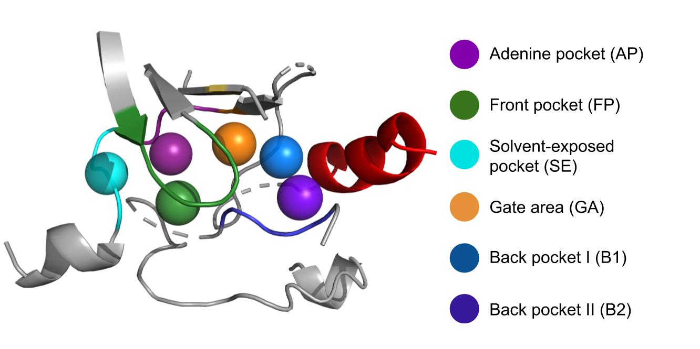

# KinaseFocusedFragmentLibrary

## Exploring the chemical space of kinase inhibitors: Subpocket-based fragmentation for data-driven recombination

### Introduction
Protein kinases play a crucial role in many cell signaling processes, making them one of the most important families of drug targets.
Fragment-based drug design has proven useful as an approach to develop novel kinase inhibitors. However, fragment-based methods are usually limited to a knowledge-driven approach of optimizing a focused set of fragments. 
Here, we present a data-driven fragmentation and recombination approach instead. 
A novel computational fragmentation method was implemented, which splits known kinase inhibitors into fragments with respect to the subpockets that they occupy. Thereby, a fragment library with several pools, representing the subpockets, is created.
This fragment library enables an in-depth analysis of the chemical space of known kinase inhibitors, and is used to recombine fragments in order to generate novel potential inhibitors.

##### Fragmentation:

For each input kinase-ligand complex, the kinase binding pocket is divided into six subpockets. The ligands are fragmented according to these subpockets, and a fragment library with several pools is created, where each pool corresponds to one subpocket and contains the fragments that were assigned to this subpocket.

 

<br clear="all" />

##### Recombination:

Every possible fragment recombination is enumerated in order to create a virtual combinatorial compound library. The fragments are reconnected only at the broken bonds, while preserving the original subpocket connection of each bond. 

### Usage
#### Dependencies:

A conda environment file (yml file) containing all required packages is provided.
```bash
conda env create -f devtools/conda-envs/environment.yml
```

#### Input:
Kinase-ligand structures, and two CSV files containing metadata are downloaded from the [KLIFS database](https://klifs.vu-compmedchem.nl/index.php) using the following Search options:

 

<br clear="all" />

The downloaded data should have the following folder structure:

    └── KLIFS_download
        ├── KLIFS_export.csv
        ├── overview.csv
        └── HUMAN     	               # species name  
            ├── AAK1                   # kinase name
            │   ├── 4wsq_altA_chainA   # PDB code, alternate model, chain
            │   │   ├── ligand.mol2
            │   │   ├── pocket.mol2
            │   │   └── ...
            │   └── ...
            └── ...

#### Preprocessing:

```bash
python kinase_focused_fragment_library/preprocessing/main.py -f /path/to/KLIFS/data -o put/path/to/FragmentLibrary
```
The output file ```/path/to/KLIFS/data/KLIFS_download/filtered_ligands.csv``` contains metadata on all ligands that were chosen for the fragmentation. 
Metadata on the discarded ligands is written to ```put/path/to/FragmentLibrary/discarded_ligands/preprocessing.csv```.

#### Fragmentation:

```bash
python kinase_focused_fragment_library/fragmentation/main.py -f /path/to/KLIFS/data -o /path/to/FragmentLibrary
```
A picture of each fragmented ligand is drawn and stored in ```/path/to/FragmentLibrary/fragmented_molecules/```
Metadata on discarded ligands is written to ```/path/to/FragmentLibrary/discarded_ligands/fragmentation.csv```.
The fragment library is written to  ```/path/to/FragmentLibrary```. For each subpocket, one folder containing one SD file exists:

    └── FragmentLibrary/
        ├── AP
        │   └── AP.sdf
        ├── B1
        │   └── B1.sdf
        ├── B2
        │   └── B2.sdf
        ├── discarded_ligands
        │   ├── fragmentation.csv
        │   └── preprocessing.csv        
        ├── FP
        │   ├── FP.sdf
        ├── fragmented_molecules
        │   ├── 4wsq_altA_chainA.png
        │   └── ...
        ├── GA
        │   └── GA.sdf
        ├── SE
        │   └── SE.sdf
        └── X
            └── X.sdf

In addition to the standard fields of the SDF format (3D coordinates of each atom and bonds between atoms), the files include the following associated data for each fragment:

* PDB code of the original kinase-ligand complex and of the ligand itself
* Chain and alternate model of this complex in KLIFS
* Kinase, kinase family, and kinase group
* Subpocket of each atom, including dummy atoms
* BRICS environment type for each atom (with dummy atoms having 'na' assigned)

#### Fragment analysis:

Jupyter notebooks for analyzing the fragment library are stored in ```kinase_focused_fragment_library/analysis/fragment_analysis/```.

#### Recombination:

```bash
python kinase_focused_fragment_library/recombination/main.py -f /path/to/FragmentLibrary -o /path/to/CombinatorialLibrary -s AP -d 4
```
The SD files in the ```/path/to/FragmentLibrary``` are used as input for the recombination, while the above folder structure and file names are expected.
The ```-s``` option specifies one or multiple subpockets from which the recombination procedure will start, meaning that all resulting molecules will contain a fragment coming from this subpocket/these subpockets (default: all subpockets). The ```-d``` option specifies the maximum number of fragments to combine (default: 6).
Multiple binary (pickle) files are written to ```/path/to/CombinatorialLibrary/results/```, which contain pickled objects representing the recombined molecules. For each molecule, this object contains the fragment IDs and the bonds (as tuples of atom IDs) between the fragments. 

#### Recombined molecule analysis:
```bash
python kinase_focused_fragment_library/analysis/ligand_analysis/main.py -f /path/to/FragmentLibrary -klifs /path/to/KLIFS/data -chembl chembl_standardized_inchi.txt -o /path/to/CombinatorialLibrary
```

Only in this step, the recombined molecules are constructed as actual Molecule objects. These molecules are then compared to the molecules given in ```chembl_standardized_inchi.txt``` (which should contain one standardized InChI string per line) and to the original KLIFS ligands from which the fragments were built.
For each molecule, an object is stored in the file ```/path/to/CombinatorialLibrary/cominatorial_library.pickle``` which includes the representation of the molecule as created in the recombination step, its number of heavy atoms, as well as binary values describing whether the molecule
* fulfills Lipinski's rule of five,
* has a molecular weight <= 500,
* has a logP <= 5,
* has a number of hydrogen bond donors <=5 and acceptors <= 10,
* was found in the original ligands,
* is a true substructure of an original ligand,
* was found in ChEMBL.

Jupyter notebooks for analyzing these objects are stored in ```kinase_focused_fragment_library/analysis/ligand_analysis/```.
